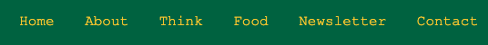
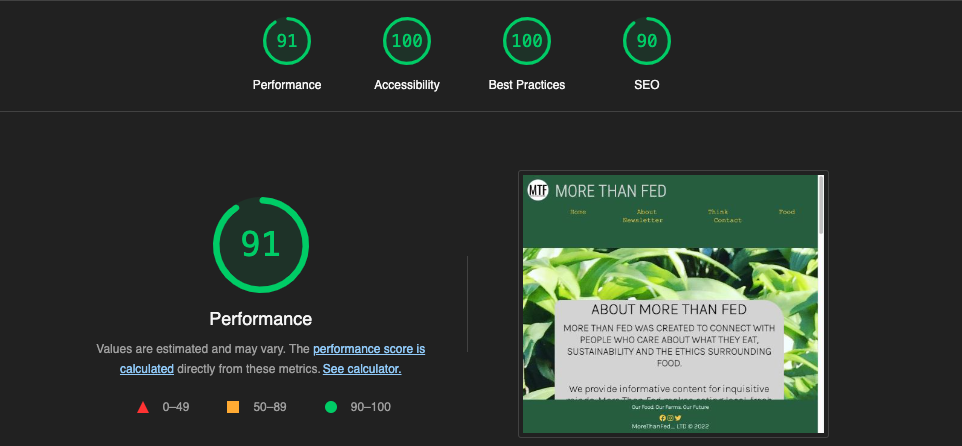
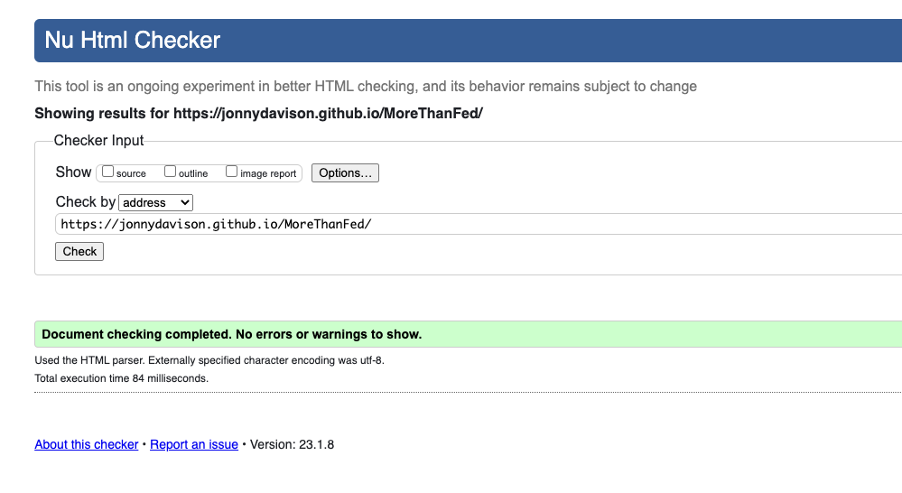
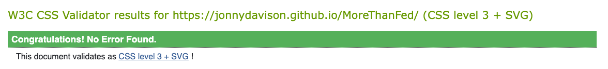

# [MoreThanFed](https://jonnydavison.github.io/MoreThanFed/index.html)              
[Visit Repository](https://github.com/JonnyDavison/MoreThanFed)

## [More Than Fed](https://jonnydavison.github.io/MoreThanFed/index.html) was created to connect with people who care about what they eat, sustainability and the ethics surrounding food.
We provide informative content for inquisitive minds. More Than Fed makes eating local, fresh produce seem less of a challenge with accessible ways to make sustainable, ethical changes. We believe that you are more likely to appreciate its true value when you know where your food has come from, who produced it and the effort that went into getting it from field to fork.

We want to offer up exciting debates about the food industry. How our food is produced, and why it matters.

## Project goals
More Than Fed aims to educate, inform and enlighten the user on sustainability surrounding the food industry by discussing thought-provoking topics openly, aiming to arrive at viable solutions. 

### Target audience
The target audience aims to engage with a broad demographic of people who care about what they eat and its effects on the planet and others around them. The goal is to promote to like-minded people and grow the understanding and audience for this content. 

### First-Time Visitor:
- I want to understand the core purpose of the website and learn more about sustainability 
- Easy navigation, making the discovery of information accessible and a positive experience
- Check their social media for current events

### Returning Visitor
- I want to find articles and recipes to read and try
- Find contact details and ask any questions I may have
- follow up on social media and join the conversation

### Frequent Visitor
- Visit newly added content
- Sign up for the Newsletter
- Interact by sharing thoughts and ideas

## Features 

The features added have been done to encourage excellent user experience, ease of use and natural flow. 

- Navigation bar
    - Featured on all site pages, the responsive design flows on any device. The Navigation bar leads you through Home, About, Think, Food, Newsletter and Contact
    - This section allows easy access throughout the site on any device, directing you to the different sections. 

- The footer 
    - The tag line keeps the user engaged with the subject matter in a clear and concise way
    - Social Media links for More Than Fed encouraging engagement, these open on a new tab for easy user navigation
    - The © shows the ownership of the content and website
     

- Home Page (index.html)
    - Welcomes and invites users via a call to action to navigate throught the site
- About Page (about.html)
    - Provding furhter information about More Than Fed
- Think Page (think.html)
    - Holds and displays articles, and video content
- Food Page (food.html)
    - Displays recipe option and video content
- Newsletter Page (newsletter.html)
    - Sign up for newsletter, updates and content direct
- Contact Page (contact.html)
    - Added value through interaction between More Than Fed and end user

## Technologies Used
 ### Languages 
- HTML5
- CSS3

### Frameworks & Tools
1. [Google Fonts](https://fonts.google.com/about)
     - Library used to imnport "Karla", "Roboto Condensed" &"Courier New" used throughout
2. [Hover.css](https://www.w3schools.com/cssref/sel_hover.php)      
    - Styling of the Nav elements, to increase UX/UI 

3. [Font Awesome](https://fontawesome.com/)
    - Added aesthetic and improved UX with recognisable icons
4. [Git Hub](https://github.com/JonnyDavison/MoreThanFed)
    - Used to store and deploy the site 
5. [Git](https://www.gitpod.io/)
    - Used for Version control, code editing an commiting through terminal commands, git commit & git push. 
6. [Chat GPT](https://openai.com/blog/chatgpt/)
    - Open AIs Chat GPT platform was used to create "Wild Garlic, Foraging and the benefits of Sustainable eating."
7. [Am I Responsive](https://ui.dev/amiresponsive)
    - Responisveness testing

## Testing 
Testing throughout the development process ensureed the fuctionality and flow gave both good UX and UI. Further testing lead to format changes for the images to reduce their size, further increasing the loading speeds and better UX. 

As devoplment moved to responsiveness, there was increases to the break point px and a furhter break point added to imporve results.  

- tested on chrome, fire fox, safari 
- responsiveness using Chrome dev tools 
- nav menu, log, title all easy to read and meet accessability expectations
- all the links work and open to a seperate page
- both form work and have required feilds, email feild will only accept email address 

## Light house report

## W3C html & CSS validator 
HTML & CSS3 both validated on the W3C validation as below.

    

            
Valid CSS!

    

        
## Deployment
This site is deployed through GitHub pages
Deployment method   
- Enter the GitHub repository
- Navigate to 'Settings'
- On the left side of the page hit 'Pages'
- Scroll to 'Build and deployment'
- Set source to 'Deploy from a branch'
- Below in 'Branch' select 'main' and 'root' 
- The page will refresh and a banner will appear to confiurm succeful deployment 
- the link will be in the banner along with 'Visit site'

N.B - it may take a few minuits to build/deploy

## Credits 

### Code 
Support and resourses found at
- [Stack Overflow](https://stackoverflow.com/)
- [W3school](https://www.w3schools.com/)

### Content
Images - where created and owned by the developer Jonny Davison, from a real world project. 

Video - Content and embed code from [YouTube](https://www.youtube.com/)

### Acknowledgements
- Course marterial at Code Institute, including ['Love running'](https://github.com/Code-Institute-Solutions/readme-template)
- Stack

