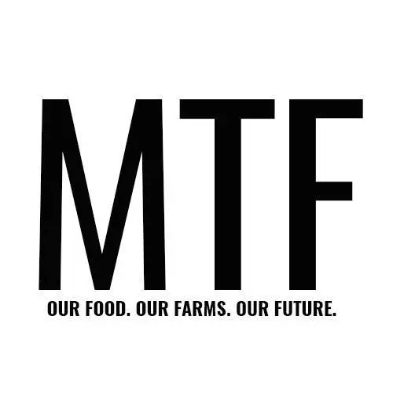

# [MoreThanFed](https://jonnydavison.github.io/MoreThanFed/index.html) 
[Visit Repository](https://github.com/JonnyDavison/MoreThanFed)

## [More Than Fed](https://jonnydavison.github.io/MoreThanFed/index.html) was created to connect with people who care about what they eat, sustainability and the ethics surrounding food.
 
We provide informative content for inquisitive minds. More Than Fed makes eating local, fresh produce seem less of a challenge with accessible ways to make sustainable, ethical changes. We believe that when you know where your food has come from, who produced it and the effort that went into getting it from field to fork, then you are more likely to appreciate it’s true value. 

We want to offer up interesting debates about the food industry. How our food is produced, and why it matters.

## Project goals
The goal of More Than Fed is to educate, inform and enlighten the user on sustaibility surrounding the food industry by discussing thought provoking topics openly, aiming to arrive at viable solutions. 

### Visitor Goals
inform, educate and encourge visitors to be proactive around the issue in the food industry.

#### First Time Visitor:
- I want to understand the core purpose of the website and learn more about sustainability 
- Easy navigation, making dicovery of information easy and a positive experince
- Check their social media for current events

#### Reutning Visitor
- I want to find articles and recipes thati can read and try
- Find contact details and ask any questions I may have

#### Frequent Visitor
- 

## Target audiance

Deployed at : XYZ github

## Features 
Insert screenshots of the project features, give a brief description of what each feature does and explain its value to the user
The features added have been done to encourage great user experieance, ease of use and natural flow. 
- Header
- Logo 
- Navigation bar
    - Featured on all site pages, the responsive design flows on any device. The Navigation bar leads you through, Home, About MTF, Think, Food and Contact
    - This section allows easy access throughout the site on any device directing you to the different sections. 
- The footer
    - social linkls on a new tab
    - 
- Home Page (index.html)
- About Page (about.html)
- Think Page (think.html)
- Food Page (food.html)
- Newsletter Page (newsletter.html)
- Contact Page (contact.html)
- Articles (think-a*.html, food-a*.html)

## Technologies Used

 ### Languages Used
- HTML5
- CSS3
 ### Tools

<!-- * {
    outline: 1px solid #f00 !important;
} -->

## Testing 
- tested on chrome, fire fox, safari 
- responsiveness using dev tools 
- nav menu, log, title all easy to read and meet accessability expectations
- all the links work and open to a seperate page
- both form work and have required feilds, email feild will only accept email address 

Testing throughout the development process ensureed the fuctionality and flow gave both good UX and UI. Furhter testing lead to format changes for the images to reduce their size, further increasing the loading speeds and better UX. 
As devoplment moved to responsiveness, there was increases to the break point px and a furhter break point added to imporve results.  

## Light house report

## W3C html & CSS validator 

## Deployment

## Content/media 
The content was created by myself, Jonny Davison, from a previos real world project. 

## Credit 
Code insta
font awsome 
love running proiject 
stack overflow
W3C HTML validator 
W3C CSS validatator 
OpenAI chat GPT
Am I resoponsive 
youtube
love running 